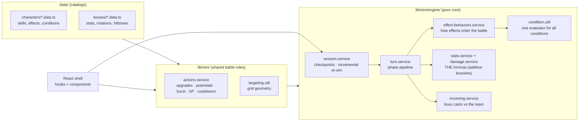

# Brown Dust 2 Simulator

A team builder and turn-by-turn damage simulator for Brown Dust 2 boss content
(Fiend Hunt / Guild Raid). Build a team, script each turn, and see the resolved
damage bands (min / expected / max) with a per-multiplier formula breakdown,
SP economy, cooldowns, and a survival simulation of the boss's counterattacks.

Client-side only — all persistence is versioned `localStorage`, so there's no
backend to run.

## Tech stack

- **Next.js** (App Router) + **React 19**
- **Tailwind CSS 4**
- **TypeScript** (strict)
- **pnpm**

## Getting started

```bash
pnpm install
pnpm dev
```

Open [http://localhost:3000](http://localhost:3000).

## Commands

- `pnpm dev` — start the dev server
- `pnpm build` — production build
- `pnpm lint` / `pnpm typecheck` — lint / typecheck

## Architecture

The interesting part is the simulation core (`lib/sim/`): a pure, deterministic,
data-driven battle engine with a React shell around it.



### Design principles

- **The state is a value.** `simulateTurn(state, …) → { result, next }` never
  mutates its input. Every turn boundary is therefore a checkpoint you can
  cache, resume from, or fork.
- **Incremental by construction.** `simulateIncremental` diffs the turn script
  against the previous run and re-simulates only from the first changed turn;
  editing turn 5 of an 8-turn script reuses turns 1–4 verbatim. The UI threads
  each variant's previous run back in through a small cache.
- **One formula, two files.** All damage arithmetic lives in `stats.service`
  (additive stat brackets) and `damage.service` (the per-hit pipeline:
  `ATK × Skill% × Defense × Property × Chain × Vulnerability × Weak × Crit`),
  aligned to the community-verified BD2 formula. Effect behaviors, conditions
  and phases never do math — so the whole formula stays auditable in one
  sitting.
- **Content is data, behavior is dispatch.** Characters and bosses are typed
  catalogs. Skill effects form a discriminated union by family (stat buffs,
  DoTs, shields, counters, reactives…) so invalid field combinations are type
  errors; `effect-behaviors.service` dispatches on the family to decide how an
  effect enters the battle. Every "only if / only while" rule shares one
  `Condition` vocabulary and one evaluator.
- **The engine never enforces SP/cooldowns.** The script always executes as
  written; the sequencer UI flags overdrafts and on-cooldown picks via the
  same shared rules module (`actions.service`), so the numbers and the
  warnings can't drift apart.

### Project layout

```
app/          Routes only — thin pages composing hooks + components.
components/   Feature components + sequencer/ (the battle workspace) + ui/.
hooks/        Team-page state + autosave, localStorage hydration.
lib/          Logic: bosses, characters, storage (versioned), assets, format.
  sim/        Shared battle rules (actions, targeting) + engine/ (pure core).
data/         Hand-edited catalogs: characters (roster) + bosses (seed configs).
```

See [CLAUDE.md](CLAUDE.md) for the full architecture notes and file-naming
conventions, and
[docs/character-update-checklist.md](docs/character-update-checklist.md) for how
character skill data is sourced and encoded.
